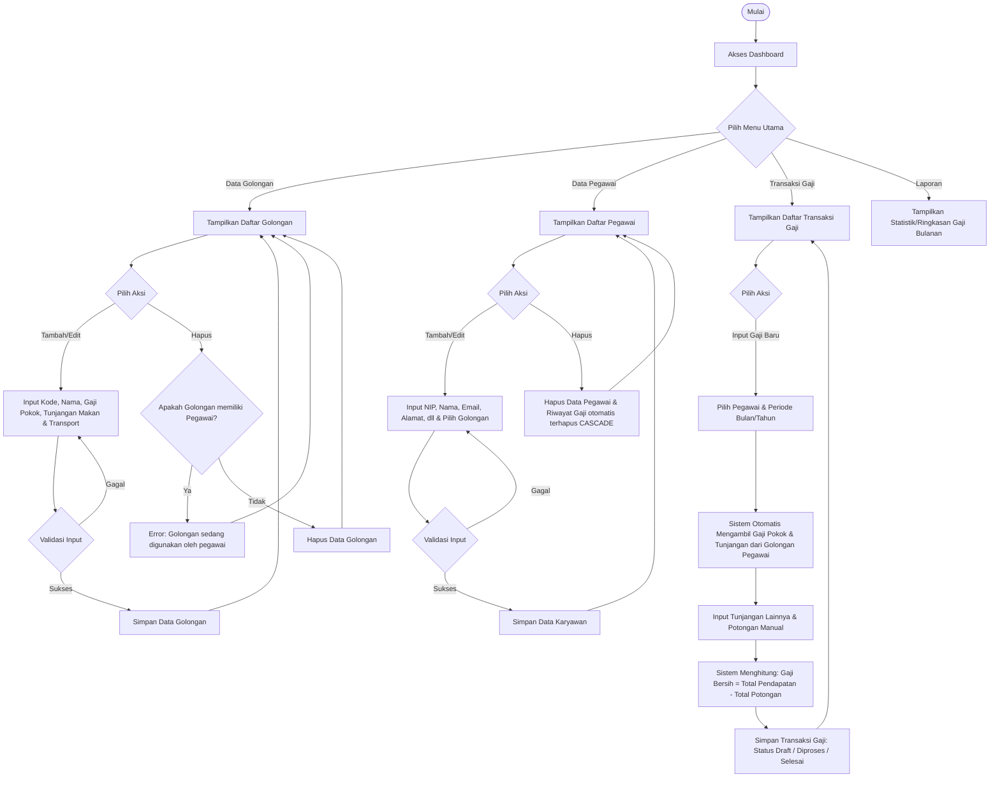

# Flowchart Sistem Aplikasi Penggajian

Dokumen ini menjelaskan alur kerja (workflow) dari aplikasi penggajian karyawan, mulai dari pengelolaan master data (Golongan & Pegawai) hingga proses perhitungan gaji bulanan.

## Diagram Alur Kerja (Flowchart)

Berikut adalah diagram alur kerja menggunakan Mermaid. VS Code akan merender ini sebagai diagram visual jika Anda memiliki ekstensi *Markdown Preview Mermaid Support* atau membukanya di editor Markdown.

## Penjelasan Alur Kerja

1. **Master Data Golongan**: 
   * Merupakan data master yang berisi komponen standar keuangan (Gaji Pokok, Tunjangan Makan, Tunjangan Transport).
   * Data ini tidak dapat dihapus jika masih ada pegawai yang terhubung ke golongan tersebut (`onDelete('restrict')`).

2. **Master Data Pegawai**:
   * Setiap pegawai wajib dihubungkan ke salah satu golongan agar sistem tahu basis gaji pokok dan tunjangannya.

3. **Proses Penggajian (Komponen Gaji)**:
   * Saat admin membuat input gaji baru untuk pegawai tertentu pada bulan/tahun tertentu, sistem otomatis mengambil default `gaji_pokok`, `tunjangan_makan`, dan `tunjangan_transport` berdasarkan golongan pegawai tersebut.
   * Admin kemudian bisa menambahkan komponen tambahan seperti *Tunjangan Lainnya* atau *Potongan Absensi*.
   * Sistem menghitung rumus:
     $$\text{Gaji Bersih} = (\text{Gaji Pokok} + \text{Tunjangan Makan} + \text{Tunjangan Transport} + \text{Tunjangan Lainnya}) - (\text{Potongan Absensi} + \text{Potongan Lainnya})$$
   * Data disimpan dengan status tertentu (`draft`, `diproses`, atau `selesai`).
